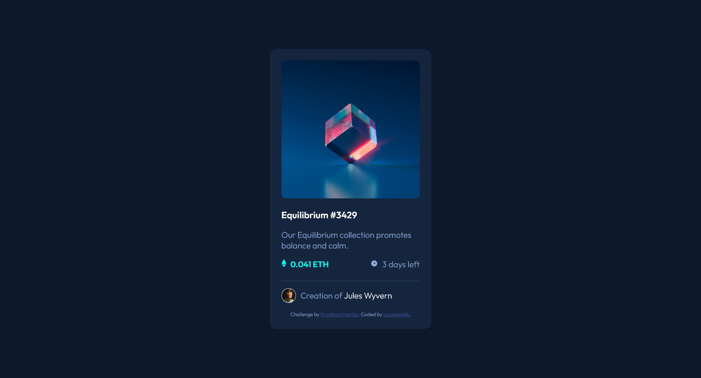

# Frontend Mentor - NFT preview card component solution

This is a solution to the [NFT preview card component challenge on Frontend Mentor](https://www.frontendmentor.io/challenges/nft-preview-card-component-SbdUL_w0U). Frontend Mentor challenges help you improve your coding skills by building realistic projects. 

## Table of contents

- [Overview](#overview)
  - [The challenge](#the-challenge)
  - [Screenshot](#screenshot)
  - [Links](#links)
- [My process](#my-process)
  - [Built with](#built-with)
  - [What I learned](#what-i-learned)
  - [Continued development](#continued-development)
  - [Useful resources](#useful-resources)
- [Author](#author)

## Overview

### The challenge

Users should be able to:

- View the optimal layout depending on their device's screen size
- See hover states for interactive elements

### Screenshot

### Links

- Solution URL: [https://github.com/Lasseignejk/NFT-preview-card]
- Live Site URL: [https://lasseignejk.github.io/NFT-preview-card/]

## My process

### Built with

- Semantic HTML5 markup
- CSS custom properties
- Flexbox

### What I learned

Before this project, I'd never done an image overlay. I'd learned about the position property, but I didn't know it could be used in that way! 

I was also reminded that I need to make sure to include semantic HTML for accessibility. 

### Continued development

For future projects, I want to continue to use semantic HTML and to become more comfortable with Flexbox. This project gave me a lot of confidence. It showed me that I can code something on my own! 

### Useful resources

- [Image Overlay Tutorial](https://www.youtube.com/watch?v=exb2ab72Xhs) - This helped me to understand how to put an image overlay on something. I looked at many other resources, but I found that the video was the easiest to understand. 

## Author

- Frontend Mentor - [@Lasseignejk](https://www.frontendmentor.io/profile/Lasseignejk)

